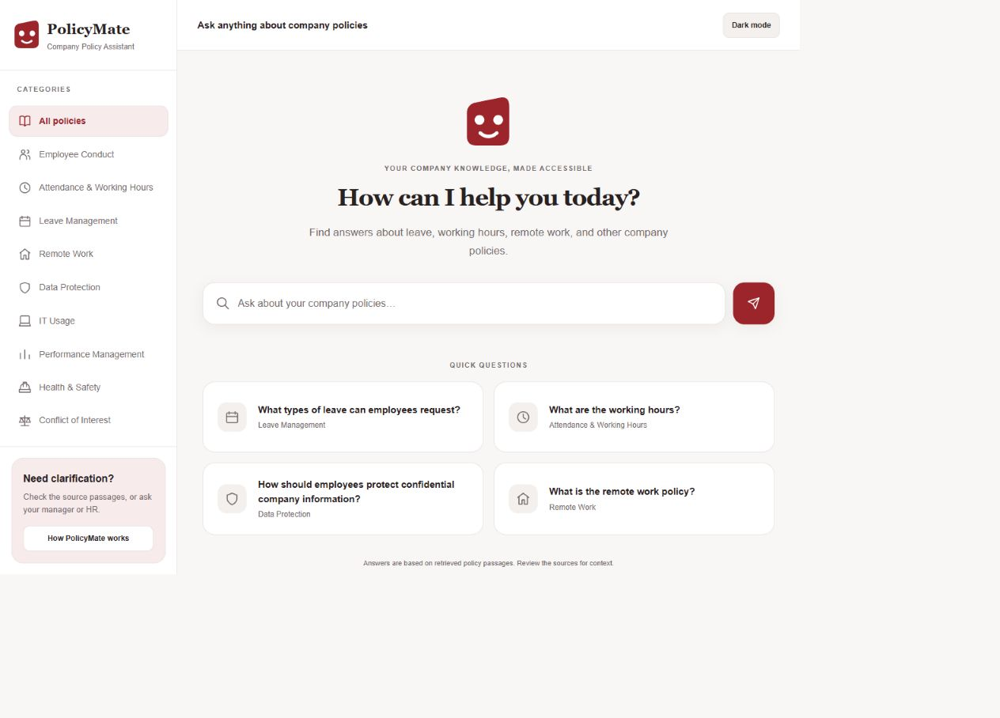
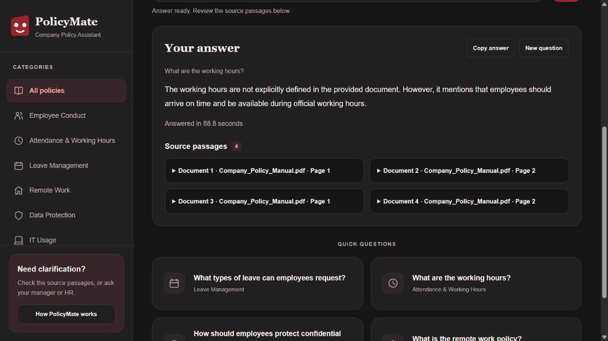
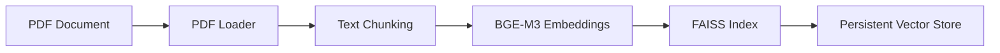
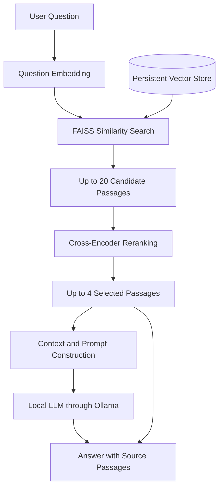

# Document Intelligence RAG Assistant

A Retrieval-Augmented Generation (RAG) application that allows users to ask questions about PDF documents and receive context-aware answers with source references using local Large Language Models.

I built this project to explore how document processing, embeddings, vector search, reranking, and local LLMs work together in a complete AI application. The implementation includes a document ingestion pipeline, a FastAPI backend, a command-line interface, and a responsive browser interface called **PolicyMate**.

**Python · LangChain · FastAPI · FAISS · Hugging Face · Ollama · Tailwind CSS · Docker**

## Overview

Large Language Models do not automatically have access to private or custom documents. Answering questions about those documents requires a way to find relevant information and provide it to the model as context.

In this project, I implemented a pipeline that extracts text from a PDF, divides it into smaller chunks, generates embeddings, and stores them in a persistent FAISS index. When a user asks a question, the system retrieves candidate passages, reranks them, and provides the selected context to an Ollama language model.

The application returns an answer alongside the passages supplied to the model, allowing users to review the document evidence. The included frontend demonstrates this workflow through a company policy assistant.

## Features

- PDF text extraction with page metadata
- Automatic text chunking with configurable overlap
- Semantic search using BGE-M3 embeddings
- Persistent vector storage with FAISS
- Cross-encoder reranking of retrieved passages
- Context-based answer generation through Ollama
- FastAPI backend with structured request and response models
- Browser-based and CLI-based question answering
- Expandable source passages with filenames, page labels, and ranking scores
- Responsive interface with light and dark themes
- Suggested questions and policy category navigation
- Docker packaging and Docker Compose configuration

## Project Showcase

### PolicyMate - Document Question Interface

Users can browse policy categories, choose a suggested question, or ask a question directly.



### Answers with Document References

The answer view presents the generated response and expandable source cards. The example shows the assistant acknowledging that the indexed document does not specify exact working hours.



## System Architecture

### Document Ingestion Pipeline



### Query Pipeline



## Tech Stack

| Component | Technology |
| --- | --- |
| Language | Python |
| LLM Framework | LangChain |
| API Framework | FastAPI and Pydantic |
| API Server | Uvicorn |
| Vector Search | FAISS |
| Embedding Model | `BAAI/bge-m3` |
| Reranking Model | `BAAI/bge-reranker-v2-m3` |
| Local LLM Runtime | Ollama |
| Default Chat Model | `qwen2.5:3b` |
| Document Processing | PyPDF through LangChain `PyPDFLoader` |
| Frontend | HTML, JavaScript, Tailwind CSS 4 |
| Environment Configuration | python-dotenv |
| Containerization | Docker and Docker Compose |

## How It Works

### 1. Document Processing

A PDF is loaded from the local documents directory and converted into LangChain document objects with page metadata.

The text is divided into overlapping chunks using `RecursiveCharacterTextSplitter`. The default configuration uses **500-character chunks** with **100-character overlap**, preserving some surrounding context between adjacent chunks.

### 2. Embedding Generation

Each chunk is converted into a numerical vector using the `BAAI/bge-m3` embedding model. These vectors represent semantic information and allow the system to compare a question with document passages beyond exact keyword matches.

Embeddings are normalized and generated on the CPU.

### 3. Vector Storage

The embeddings and associated documents are stored in a FAISS index. The index is saved locally and loaded for subsequent queries, avoiding the need to process the PDF again each time the application starts.

### 4. Retrieval and Reranking

The question is embedded and used to retrieve up to **20 candidate passages** from FAISS.

A separate cross-encoder, `BAAI/bge-reranker-v2-m3`, scores each question–passage pair and selects up to **4 passages** for the final context. This adds a second relevance-ranking step before answer generation.

### 5. Answer Generation

The selected passages, document labels, page labels, and user question are assembled into a prompt and sent to Ollama.

The prompt instructs the language model to answer from the provided context and acknowledge missing information. The API returns the answer, selected source passages, ranking scores, and processing duration. Users can inspect the sources when assessing the response.

## Engineering Highlights

- **Modular implementation:** separate services handle extraction, chunking, embeddings, vector storage, retrieval, reranking, and generation.
- **Shared model resources:** the backend loads models and the vector index once per server process.
- **Controlled inference:** blocking work runs in a thread pool, while a per-process lock prevents overlapping inference on shared resources.
- **Input validation:** questions are trimmed, limited to 2,000 characters, and validated before processing. Unexpected request fields are rejected.
- **Inspectable responses:** source cards display the exact passages supplied to the model. Answers and passages are rendered as text in the browser.
- **Containerized delivery:** a multi-stage Docker build compiles the frontend stylesheet and runs the application as a non-root user.

## Installation

### Prerequisites

- Python 3.14; the development environment and Docker image use Python 3.14.7
- Ollama installed locally
- Internet access for initial package and model downloads
- Sufficient memory and storage for the embedding, reranking, and chat models

Node.js and npm are optional unless rebuilding the frontend stylesheet.

### 1. Clone the Repository

```bash
git clone https://github.com/ahmed-rakib/PolicyMate-RAG-assistant.git
cd rag-inteligence-document-assistant
```

### 2. Create a Virtual Environment

```bash
python -m venv myenv
```

Activate the environment in Windows PowerShell:

```powershell
.\myenv\Scripts\Activate.ps1
```

On Linux or macOS:

```bash
source myenv/bin/activate
```

### 3. Install Dependencies

```bash
python -m pip install --upgrade pip
python -m pip install -r requirements.txt
```

## Environment Setup

Download the default Ollama model:

```bash
ollama pull qwen2.5:3b
```

If Ollama is not already running, start it in a separate terminal:

```bash
ollama serve
```

Create a `.env` file using `.env.example` as a template:

```dotenv
OLLAMA_BASE_URL=http://localhost:11434
CHAT_MODEL=qwen2.5:3b
```

To use another chat model, download it through Ollama and update `CHAT_MODEL`. The application also supports `OLLAMA_MODEL` as a fallback when `CHAT_MODEL` is unset.

## Document Indexing

Create `data/documents/` and place your PDF at:

```text
data/documents/Company_Policy_Manual.pdf
```

To use a different path, update `pdf_path` in `ingest.py`.

Run the ingestion pipeline from the project root:

```bash
python ingest.py
```

This loads the PDF, creates chunks, generates embeddings, and saves the FAISS index in:

```text
data/vector_store/index.faiss
data/vector_store/index.pkl
```

Documents and indexes are excluded from Git. A fresh checkout requires its own PDF and indexing step. Rebuild the index and restart the application after changing the document, chunking settings, or embedding model.

## Run the Application

Start the FastAPI server:

```bash
python -m uvicorn app.main:app --host 127.0.0.1 --port 8000 --workers 1
```

Wait for model initialization to finish, then open [http://127.0.0.1:8000](http://127.0.0.1:8000).

The first ingestion and application startup may take longer while models download. Once the interface is ready, enter a question or select one of the suggested questions.

### CLI Question Answering

```bash
python query.py
```

The CLI displays the answer, source previews, and ranking scores. It applies a reranker cutoff of `0.3`; the web API has no cutoff by default, so the selected passages may differ.

## API Documentation

Interactive documentation is available at [http://127.0.0.1:8000/docs](http://127.0.0.1:8000/docs).

### Ask a Question

`POST /api/ask`

```json
{
  "question": "What is the remote work policy?"
}
```

| Response Field | Description |
| --- | --- |
| `answer` | Generated answer text |
| `sources` | Passages supplied to the language model |
| `sources[].document_number` | Passage position in the selected context |
| `sources[].filename` | Source document filename |
| `sources[].page` | Page label |
| `sources[].content` | Source passage text |
| `sources[].retrieval_score` | Semantic retrieval score |
| `sources[].reranker_score` | Cross-encoder score |
| `retrieved_count` | Number of candidates before reranking |
| `elapsed_seconds` | Server-side processing duration |

The API returns `422` for invalid input, `429` when another inference request is active, and `503` if generation fails.


## Docker Deployment

Prepare `.env`, download the Ollama model, and generate the vector index before starting the container. The supplied Compose configuration uses Ollama on the host and mounts the existing index read-only.

```bash
docker compose up --build -d app
docker compose logs -f app
```

Open [http://127.0.0.1:8000](http://127.0.0.1:8000) after startup completes.

Compose sets `CHAT_MODEL=qwen2.5:3b` and `OLLAMA_BASE_URL=http://host.docker.internal:11434`, overriding these values in `.env`. Adjust `compose.yaml` when using another model or endpoint. On Linux Docker Engine, host access may require a `host.docker.internal:host-gateway` mapping and an Ollama listening address reachable from the container.

Stop the application:

```bash
docker compose down
```

## Frontend Development

The repository includes a compiled stylesheet. To rebuild it after editing `app/static/input.css`:

```bash
npm ci
npx @tailwindcss/cli -i ./app/static/input.css -o ./app/static/style.css --minify
```

Replace `--minify` with `--watch` during development. FastAPI serves the frontend directly.

## Current Limitations

- The ingestion script processes one PDF per run and rebuilds the index.
- Document upload and OCR for scanned PDFs are not implemented.
- Each question is independent; conversation history is not included in the model context.
- Policy categories change suggested questions without filtering retrieval.
- Source passages support review, but generated answers and sentence-level citations are not automatically verified. Ranking scores are not confidence percentages.
- The application has no authentication or per-user document isolation and is intended for local use or controlled demonstrations.
- FAISS metadata uses pickle deserialization; only load indexes from trusted sources.

## Future Improvements

- Multi-document upload and document management
- Authentication and per-user document access
- Streaming responses
- Hybrid keyword and semantic retrieval
- Conversation history and follow-up questions
- Retrieval evaluation and automated regression tests
- OCR support for scanned documents
- Authenticated cloud deployment

## License

This project was created for learning and portfolio purposes. You may view the code for learning reference. Reuse, redistribution, or claiming this project as your own is not permitted without the author's permission.

## Author

**Rakib Ahmed**

GitHub: [ahmed-rakib](https://github.com/ahmed-rakib)
